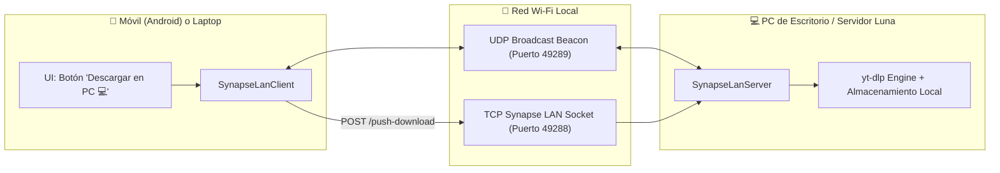

# Plan — Aurora Synapse LAN Link (Descarga Remota y Sincronización Inter-Dispositivos)

- **Fecha de inicio:** 2026-08-16
- **Estado:** En ejecución
- **Objetivo:** Implementar la capa de red local del *Aurora Synapse Protocol* en Luna Fetch para permitir:
  1. Descubrimiento automático zero-config de dispositivos en la misma red Wi-Fi (PC, laptop, teléfono).
  2. Mandar a descargar enlaces desde el teléfono a la PC (y viceversa) con un solo clic.
  3. Sincronización bidireccional de historiales de descargas.

---

## 1. Alcance y Arquitectura

---

## 2. Entregables Técnicos

### Capa de Dominio (`domain/synapse/lan`)
- **`SynapseDevice.kt`**: Modelo del dispositivo descubierto (`id`, `name`, `type`, `ip`, `port`, `os`, `lastSeenMs`).
- **`SynapseLanModels.kt`**: Modelos serializables (`PushDownloadRequest`, `LanDeviceBeacon`, `LanHistorySyncRequest`).
- **`SynapseLanDiscovery.kt`**: Motor de descubrimiento UDP broadcast en `49289`.
- **`SynapseLanServer.kt`**: Servidor ligero de red local en `49288` (gestiona recepción de enlaces y sincronización).
- **`SynapseLanClient.kt`**: Cliente para despachar órdenes remotas hacia otros dispositivos de la LAN.

### Capa de Presentación y UI
- **`LunaFetchState.kt`**: Estado de dispositivos descubiertos (`discoveredPeers`) y dispositivo destino seleccionado.
- **`LunaFetchPresenter.kt`**: Acciones `pushDownloadToDevice(device, url, format, quality)` y `syncHistoryWithDevice(device)`.
- **`LinkCard.kt` / `QuickDownloadSheet.kt`**: Selector / botón contextual **«💻 Descargar en PC»** cuando se detectan dispositivos en la red local.

---

## 3. Criterios de Finalización
- [ ] Descubrimiento UDP operativo entre dispositivos en la misma subred.
- [ ] Servidor LAN en `49288` procesando descargas remotas y mostrando feedback en el dispositivo receptor.
- [ ] UI permitiendo enviar descargas directamente a la PC desde el teléfono o laptop.
- [ ] Compilación y tests exitosos en Desktop JVM y Android.
- [ ] Documentación en `Core-Docs/features/aurora-synapse/apps-adaptadas/luna-fetch.md`.
